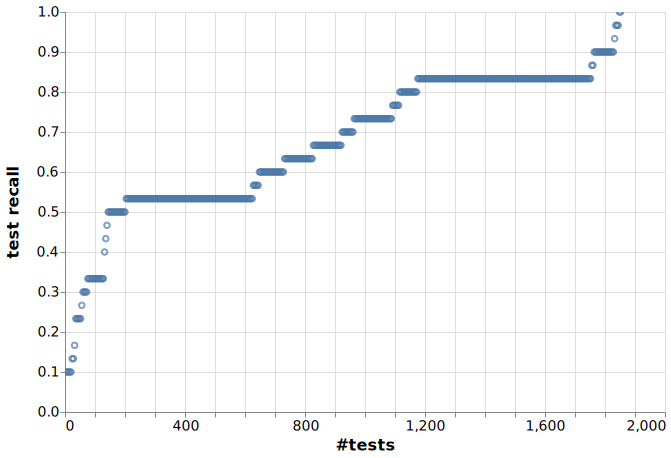

[](https://github.com/maropu/predictive-testing/blob/master/LICENSE)
[](https://github.com/maropu/predictive-testing/actions/workflows/tests.yml)

Testing is an essential part of CI (Continuous International) to make software reliable and maintainable.
The number of tests tends to increase monotonically and, in case of complicated software, it can take several hours to run tests.
However, this kind of long-running tests can be a bottleneck of development process. For instance, in a Pull Request of GitHub,
an author of the Pull Request might need to pass all tests for making sure that there is no fault in his/her code changes before the changes reviewed.
Therefore, fast/smart testing is one of major interests in modern software engineering.

An earlier study [1] has reported that a part of tests is very likely to fail and those tests are generally “closer” to the code they change.
On the other hand, “always passing” tests also exist among them. If we identify these tests ahead of time, we can make testing smarter by:

 - moving tests that are likely to fail into the top of a test list so that earlier feedback is given to developers, or
 - running a small subset of those tests for checking if there are faults on code changes

Therefore, the purpose of this repository is to create a logic to select the tests that are likely to fail and investigate its feasibility/efficiency.
Since the GitHub repository has a history of commits and GitHub Actions holds build/test logs,
such a logic can be built based on features extracted from those logs, e.g.,

 - pairs of code changes and their test results: which types of code changes caused test failures?
 - file correlation in commits: which set of files was merged in the same commit?
 - control flow graph: which classes are interdependent?

## Apache Spark case study

Apache Spark is a parallel and distributed analytics framework for large-scale data processing.
More than 10 years have already passed since the OSS community started to develop the Spark codebase in GitHub
and so it has too many tests exist there (the command results below show that it has around 1800 Scala tests).
[A GitHub Actions script](https://github.com/apache/spark/actions/workflows/build_and_test.yml)
runs those tests in parallel, but it takes 2-3 hours to finish it.

```
$ pwd
/tmp/spark-master

$ git rev-parse --short HEAD
38d39812c1

$ find . -type f | grep -e "\/.*Suite\.class$" | wc -l
1758
```

The number of [test result logs collected](models/spark/logs/github-logs.json) via the GitHub APIs is 553
for the past 3-4 months in GitHub Actions workflow runs and they include 1046 valid test failure cases.
With reference to an previous report [2], our current model uses the following information:

 - Change history for files: the count of commits made to modified files in the last 3, 14, and 56 days
   (`updated_num_3d`, `updated_num_14d`, and `updated_num_15d`, respectively).
 - File update statistics: the total number of additions, deletions, and changes made to modified files
   (`num_adds`, `num_dels`, and `num_chgs`, respectively).
 - File cardinality: the number of files touched in a test run (`file_card`).
 - Historical failure rates: the count of target test failures occurred in the last 7, 14, and 28 days
   (`failed_num_7d`, `failed_num_14d`, and `failed_num_28d`, respectively) and the total count
   of target test failures in historical test results (`total_failed_num`).
 - Minimal path difference between modified files and a target test file: the number of different directories
   between file paths (`path_difference`). Let's say that we have two files: their file paths are
   'xxx/yyy/zzz/file' and 'xxx/aaa/zzz/test_file'. In this example, the number of a path difference is 1.
 - Shortest distance between modified files and a target test file: shortest path distance
   in a call graph (`distance`) and the graph will be described soon after.
 - Interacted features: the multiplied values of some feature pairs, e.g.,
   `total_failed_num * num_commits` and `failed_num_7d * num_commits`.

Moreover, to prune test unrelated to code changes, we use two relations as follows:

 - File correlation in commits: if files were merged in a single commit, classes in the files are assumed
   to have correlated between each other. The number of collected commit logs is 10841
   for the past 4 years and a bi-directed graph is built from the commits logs
   (see [an example](./resources/spark_correlated_files.ipynb) for what the graph looks like).
 - Control flow graph: if a method in a class A calls a method in a class B, the class A depends on the class B.
   Since various factors (e.g., class hierarchy and runtime reflection) can affect which methods are called in a class,
   it is hard to analyze control flow precisely. Therefore, we analyze it in a coarse-grain way;
   if a class file A contains a JVM opcode 'invoke' for a class B, the class A is assumed to depend on the class B
   (see [an example](./resources/spark_dependency_graph.ipynb) for what the graph looks like).

### Current Model Evaluation

A figure below shows recall values of the current our model.
Each value means the empirical probability of catching an individual failure;
for instance, there is more than 90% chance that our model can catch a failed test when running 600 tests (around 35% of all the tests).
Note that why the recall value does not reach to 1.0 is that the pruning strategy removes away failed tests incorrectly
before computing failure probabilities.



### Selecting Tests based on Your Code Changes

You can get the tests that are likely to fail based on your code changes as follows:

```
$ echo $SPARK_REPO
/tmp/spark-master

$ git -C $SPARK_REPO diff HEAD~3 --stat
 core/src/main/java/org/apache/spark/SparkThrowable.java                                            |  9 ++++++++-
 core/src/main/java/org/apache/spark/memory/SparkOutOfMemoryError.java                              |  4 ----
 core/src/main/resources/error/README.md                                                            | 19 ++++++++++---------
 core/src/main/resources/error/error-classes.json                                                   | 19 +++----------------
 core/src/main/scala/org/apache/spark/ErrorInfo.scala                                               |  4 ++++
 core/src/main/scala/org/apache/spark/SparkException.scala                                          | 20 --------------------
 core/src/test/scala/org/apache/spark/SparkThrowableSuite.scala                                     | 17 +++++++++++++++++
 python/docs/source/reference/pyspark.sql.rst                                                       |  1 +
 python/pyspark/sql/functions.py                                                                    | 35 +++++++++++++++++++++++++++++++++++
 sql/catalyst/src/main/scala/org/apache/spark/sql/AnalysisException.scala                           |  1 -
 sql/catalyst/src/main/scala/org/apache/spark/sql/errors/QueryExecutionErrors.scala                 | 25 ++++++++++++++-----------
 sql/core/src/main/scala/org/apache/spark/sql/execution/datasources/DataSource.scala                |  2 +-
 sql/core/src/main/scala/org/apache/spark/sql/execution/datasources/json/JsonFileFormat.scala       |  2 --
 sql/core/src/main/scala/org/apache/spark/sql/execution/datasources/v2/json/JsonTable.scala         |  2 --
 sql/core/src/test/scala/org/apache/spark/sql/SQLQuerySuite.scala                                   | 19 -------------------
 sql/core/src/test/scala/org/apache/spark/sql/execution/datasources/CommonFileDataSourceSuite.scala |  2 +-
 sql/core/src/test/scala/org/apache/spark/sql/execution/datasources/json/JsonSuite.scala            | 21 ++++++++++++++++++++-
 17 files changed, 114 insertions(+), 88 deletions(-)

# Print the top 12 tests having the highest failure probabilities for the code changes above
# (3 commits originating from 'HEAD').
#
# NOTE: a script 'predict-spark-test.sh' creates a 'conda' virtual env to install required modules.
# If you install them by yourself (e.g., pip install -r bin/requirements.txt),
# you need to define a env 'CONDA_DISABLED' like 'CONDA_DISABLED=1 ./bin/predict-spark-tests.sh ...'
$ ./bin/predict-spark-tests.sh --num-commits 3 --num-selected-tests 12
[
  "org.apache.spark.SparkThrowableSuite",
  "org.apache.spark.sql.SQLQuerySuite",
  "org.apache.spark.sql.execution.datasources.json.JsonSuite",
  "org.apache.spark.sql.DataFrameSuite",
  "org.apache.spark.sql.hive.orc.HiveOrcSourceSuite",
  "org.apache.spark.sql.TPCDSModifiedPlanStabilityWithStatsSuite",
  "org.apache.spark.sql.SQLQueryTestSuite",
  "org.apache.spark.sql.TPCDSQueryTestSuite",
  "org.apache.spark.sql.TPCDSModifiedPlanStabilitySuite",
  "org.apache.spark.sql.execution.CoalesceShufflePartitionsSuite",
  "org.apache.spark.sql.hive.MultiDatabaseSuite",
  "org.apache.spark.sql.execution.adaptive.AdaptiveQueryExecSuite"
]

# '--format' option makes the output format follow ScalaTest one for running specific tests
$ ./bin/predict-spark-tests.sh --num-commits 3 --num-selected-tests 12 --format > $SPARK_REPO/selected_tests.txt
$ cd $SPARK_REPO && ./build/mvn clean test -DtestsFiles=selected_tests.txt
...
```

## TODO

 - Improve the Spark model performance, support the Python/Java tests, exclude flaky tests, ...
 - Generalize the scripts so that we can apply this method into other projects

## References

 - [1] Atif Memon et al., "Taming Google-scale continuous testing", 2017 IEEE/ACM 39th International Conference on Software Engineering: Software Engineering in Practice Track (ICSE-SEIP), pp.233-242, 2017.
 - [2] Mateusz Machalica and et al., "Predictive Test Selection", 2019 IEEE/ACM 41st International Conference on Software Engineering: Software Engineering in Practice (ICSE-SEIP), pp.91-100, 2019.
 - [3] Armin Najafi et al., "Improving Test Effectiveness Using Test Executions History: An Industrial Experience Report", 2019 IEEE/ACM 41st International Conference on Software Engineering: Software Engineering in Practice (ICSE-SEIP), pp.213-222, 2019.

## Bug reports

If you hit some bugs or have requests, please leave some comments on [Issues](https://github.com/maropu/predictive-testing/issues)
or Twitter ([@maropu](http://twitter.com/#!/maropu)).

